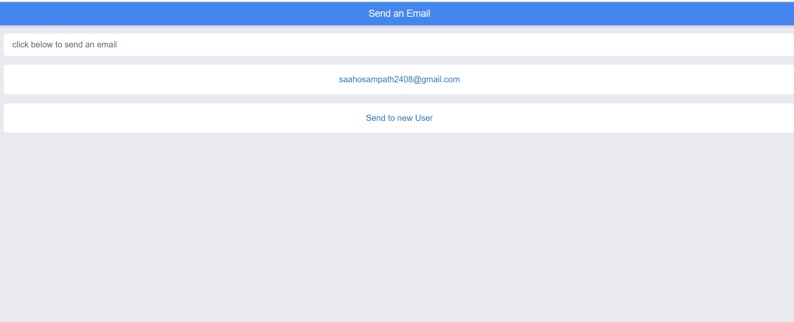
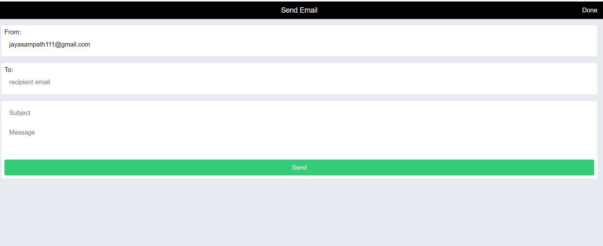
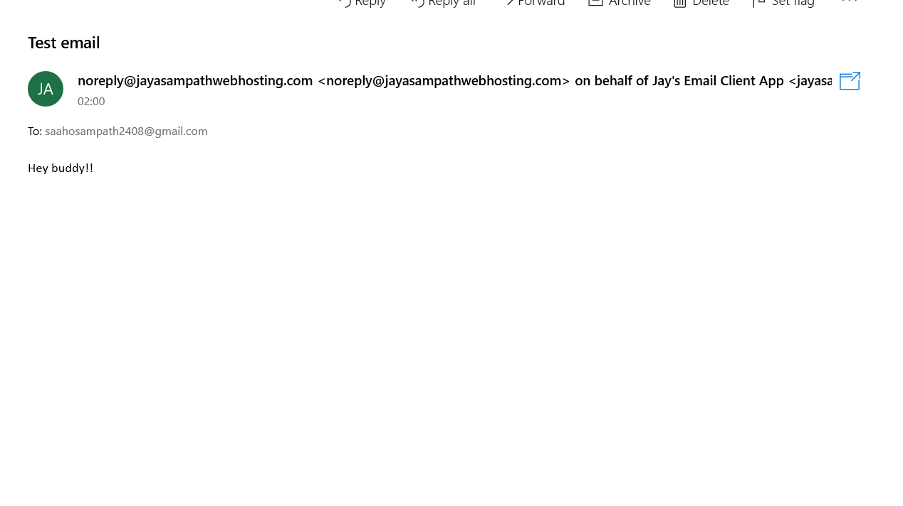

# email-client-app-using-App.js

Email client is a web cum mobile application built using AppJS. The application is basically an email sending app.

<h2>Features</h2>

<ul>
  <li>It has two pages. Home page and send email pages </li>
  <li>Home page also contains frequently used recipient list, which makes sending email faster </li>
  <li>Send to a new user, makes recipient field empty and set its frequency to 1</li>
  <li>This application uses an external php file to send email</li>
  <li>The data is sent through a ajax send request </li>
  <li>The connected php file sends the email and sends back the acknowledgement </li>
  <li>This application can be launched in google play store </li>
 </ul>
 
 <h2>Application</h2>
 
 <h3>Home page</h3>
 
 
 
 
 <h3>Send Email page</h3>
 
 
 
  <h3>Result Example</h3>
 
 
 
 <h2>In action </h2>

 see this application in action <a href="http://jayasampathwebhosting-com.stackstaging.com/projects/email-client-app/">here </a>

